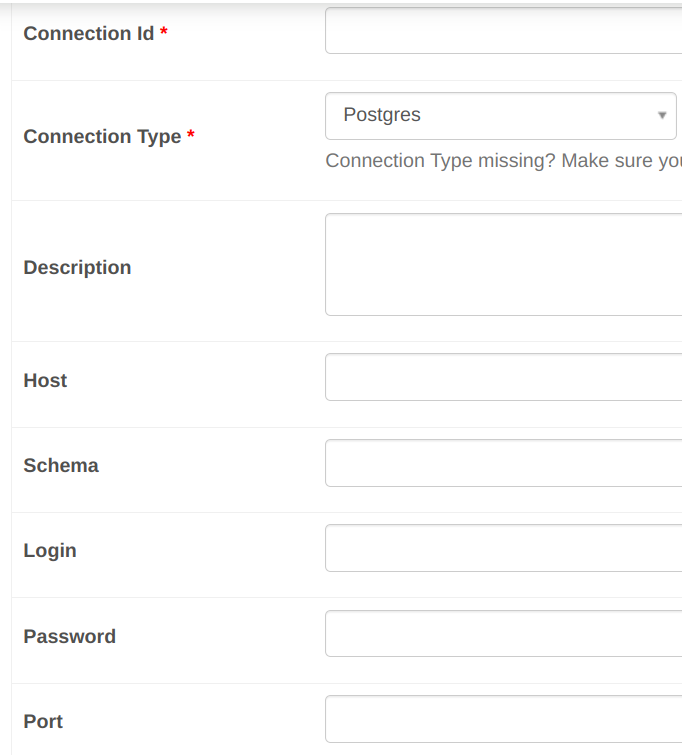

## airflow-etl-processes

Bu repo `airflow` kullanılarak iki farklı `etl` süreci gerçekleştirebilir. `etl` süreçleri belirli sınırlara sahiptir; örneğin `pandas`. Bu `etl` süreçleri belirli sınırlara sahip olmasına karşın, bu sınırlar içinde, airflow `task`larının oluşturulmasında dinamik bir yapı sunar.  

* Birinci `etl` sürecinde, `transform` işlemindeki yük verinin çekildiği `source database`'e bırakılmıştır. `source database`'den elde edilen `transform` edilmiş veriler `target database`'e yüklenmektedir.

* İkinci `etl` sürecinde ise `etl` sürecindeki bütün işlemler birbirlerinden bağımsız bir şekilde gerçekleştirilir.


## İçindekiler

* [Kullanılan Teknolojiler](#kullanılan-teknolojiler)
* [Çalışma Sistemi](#çalışma-sistemi)
    * [Method 1](#method-1)
    * [Method 2](#method-2)
* [Kurulum](#kurulum)

## Kullanılan Teknolojiler

Teknoloji   | Kullanımı
---------   | ---------
Docker      | airflow, source ve target database ortam sağlayıcısı
PostgreSQL  | target ve source database olarak
Pandas      | extract, transform ve load süreçleri için
SQLAlchemy  | Pandas'ın veritabanı işlemleri yapabilmesi için

## Çalışma Sistemi

### Method 1

Bu yöntemde, transform işlemlerinin oluşturduğu yük veritabanına verilmiştir. Aşağıda `method1` sürecinin `task` akışını görmektesiniz.

> `_data_mart` ifadelerinin bulunduğu kısımlar dinamik olarak kod ile oluşturulmaktadır.


* `truncate_or_create`: Load işleminin yapılacağı tablo `truncate` edilmektedir. Eğer bu tablo `target database`de yoksa tablo için `create` işlemi yapılmaktadır.
* `extract_transform`: `transform` işlemi için gereken filtreleme, join gibi işlemleri barındıran bir `SQL Query`'si ile `source database`'den `transform` edilmiş veri elde edilir.
* `load`: `extract_transform` task'ından elde edilen veriyi doğrudan `target database`'e load eden task.


## Method2

Bu yöntemde `source database` sadece kullanılacak olan tabloları airflow'a aktarmaktadır. Method1'deki gibi tranform işlemlerini gerçekteştirmemektedir.


> extract, truncate ve load isimleriyle başlayan bütün tasklar dinamik olarak oluşturulmaktadır. tranform taskları ise elle girilmelidir.

1. `extract_*`: `source database`'den `etl` süreci için gerekli olan bütün tablolar çekilir.
2. `transform_*`: `extract` tasklarından çekilen veriler gerekli olan `transform` task'ına iletilir ve gerekli bütün işlemler gerçekleştirilir.
3. `truncate_*`: `transform` işleminden sonra oluşturulan verinin `load` edileceği tablo `truncate` edilir.
4. `load_*`: `truncate` işleminden sonra load işlemi gerçekleştirilir.

## Kurulum

Kurulum için sadece `Docker` gerekmektedir. `Docker` kurulu ise:

```bash
docker compose up airflow-init # Komut çalışmasını bitirdikten sonra aşağıdaki komuta geçiniz.
docker compose up -d
```

> Docker kurulumu [için](https://docs.docker.com/engine/install/) <br/>
Docker ile airflow kurulumu ve daha fazla bilgi [için](https://airflow.apache.org/docs/apache-airflow/stable/howto/docker-compose/index.html)


Birkaç dakika bekledikten sonra [buradaki](http://localhost:9080/) linke tıklayarak `airflow` arayüzüne gidebilirsiniz. 

> airflow `local`inizde `9080` portunda çalışmaktadır.

Açılan ekranda size `kullanıcı adı` ve `şifre` sorulacak. Kullanıcı adı ve şifre `airflow`'dur.

> İlk açılırken hata alıcaksınızdır. `Nasıl Çalıştırılır?` kısmını okumaya devam ederek hataları gidereceksiniz.


## Nasıl çalışır hale getirilir?

Kurulum aşamasında alınan hataların nasıl giderileceği ve programın nasıl çalışır duruma getirileceği bu kısımda anlatılmıştır.


### Connection'ların eklenmesi

Bu program `source database` ve `target database` diye adlandırılan iki adet `PostgreSQL` veritabanı üzerinde işlem yapmaktadır. Bu veri tabanlarına bağlanmak için Airflow'un `Connections` kısmına database bağlantılarının eklenmesi gerekmektedir.

#### Source Database'in eklenmesi

Airflow'un `Admins` sekmesinde bulunan `Connections` sayfasını açtıktan sonra `+` işaretine basarak yeni bir connection ekleyelim.

Açılan sayfada aşağıdaki gibi bir ekran gelmesi gerekmektedir. Bu ekranda gerekli yerleri doldurmalısınız.



* Connection Id: Bu değer connection için verdiğiniz bir isimdir. İstediğiniz ismi verebilirsiniz. Bağlantıya vereceğiniz isim `source database`'e bağlanırken kullanılacaktır. Bu örnek için `source_connection`

* Connection Type: Bir sürü bağlantı tipi bulunmaktadır. Biz PostgreSQL üzerinde işlem yapacağımız için `Postgres`'i seçin.

* Host: Database'in host'udur. Host'u öğrenmek için <br/> `docker inspect airflow-etl-processes-network -f '{{range .IPAM.Config}}{{.Gateway}}{{end}}'` <br/> komutunu çalıştırınız. Çıkan değeri host kısmına yazınır.

* Schema: Schema olarak yazmaktadır lakin buradaki isim database olmaktadır. PostgreSQL'de üzerinde işlem yapacağımız database'in adıdır. Bu örnek için `source` olarak yazınız.

* Login: Veritabanı bağlantısını sağlayacak olan username olmaktadır. `source` yazınız.

* Password: Veritabanı user'ının şifresidir. `source` yazınız.

* Port: Veritabanı bağlantısı port'u. `source database`'e bağlanmak için `8000` olarak giriniz.

Gerekli yerleri doldurduktan sonra en alt kısımdaki `test` butonundan bağlantının başarılı bir şekilde gerçekleştirip gerçekleştirilmediğini görebilirsiniz. Test başarılı ise (sonucunu en üste çıkarak görebilirsiniz) `Save` butonuna basınız.

#### Target Database'in eklenmesi

Source database'in eklenmesi gibi `target database`'ini ekleyiniz. `target database` için bilgiler:

* Connection Id : `target_connection`
* Connection Type: Postgres
* Host: `docker inspect airflow-etl-processes-network -f '{{range .IPAM.Config}}{{.Gateway}}{{end}}'` komutunun çıktısı
* Schema: target
* Login: target
* Password: target
* Port: 8001

### Dummy verinin oluşturulması

Programın işlem yapabilmesi için bir veri olması gerekmektedir. `dummy_data.py` script'i örnek veri oluşturup `source database`'e yazmaktadır.

<details>
<summary>dummy_data.py parametreleri</summary>

> Bu parametreler script'in içinden değiştirilebilir.

```python
customer_count = 2500 # custormer_t tablosundaki satır sayısı. Müşteri sayısı.
store_count = 50 # store_t tablosundaki satır sayısı. Mağaza sayısı.
sales_count = 20000 # sales_tx_t, sales_t tablesundaki satır sayısı. Ürün satın alma sayısı

db_params = {
    "username": "source",
    "password": "source",
    "database": "source",
    "host": "localhost",
    "port": "8000"
}

schema = "public" # veri yazılacak database'in şemasının adı
```
</details> <br/>

> Eğer farklı bir `source connection` kullanmıyorsanız script içindeki parametrelere dokunmanıza gerek yoktur.

`source database`'e dummy data eklemek için:

```
python3 dummy_data.py
```

## Method1 nasıl çalışır hale getirilir?

Birinci metot, query'ler ile `transform` edilmiş hazır veriyi alır ve `load` işleminin gerçekleştirileceği database'e veriyi yazar.

Bu metot'u çalıştırmak için `dags/method_1/configs.json` dosyasının airflow'a `import` edilmesi gerekmektedir.

`import` işlemi için `admins`'ın altında bulunan `variables` sayfasını açınız. Daha sonra sol taraftaki `Choose File` butonuna tıklayarak `dags/method_1/configs.json` dosyasını seçiniz ve `Import Variables` butonuna basınız. Bu işlemlerden sonra `DAGs` sayfasında `etl_method1` isimli bir DAG görmelisiniz.

> Eğer göremediyseniz biraz bekleyip sayfası yenileyin.


## Method2 nasıl çalışır hale getirilir?

İkinci yöntemde `etl` süreçleri ayrı ayrı gerçekleştirilir. Method1'deki gibi `extract` ve `transform` işlemleri birlikte yapılmamaktadır.


Bu method'u çalıştırmak için `dags/method_2/configs.json` dosyasının airflow'a import edilmesi gerekmektedir.

<details>
<summary>import işlemi için</summary>

`import` işlemi için `admins`'ın altında bulunan `variables` sayfasını açınız. Daha sonra sol taraftaki `Choose File` butonuna tıklayarak `dags/method_2/configs.json` dosyasını seçiniz ve `Import Variables` butonuna basınız.
</details>

`import` işleminden sonra `DAGs` sayfasında `etl_method2` isimli bir DAG görmelisiniz.

> Eğer göremediyseniz biraz bekleyip sayfası yenileyin.

## Dag'lere yeni bir sürecin eklenmesi ve config dosyalarının açıklaması

Dinamik yapı `config.json` dosyalarına girilen değerlerle sağlanmaktadır. Bu değerlerin açıklaması ve dinamik yapının nasıl kullanılacağı bu kısımda anlatılmıştır.

### Method1

Method1 için JSON dosyasında 3 temel key değeri bulunmaktadır.

```json
{
    "method1_etl_configs" : {},
    "source_connection": "source_connection",
    "target_connection": "target_connection"
}
```

* `method1_etl_configs`: Method1 için gerekli olan belirli parametreleri barındırır. Load işleminin yapılacağı şemanın ve tablonun adı, `source database`'e çalışacak query ve load tablonun oluşturulması için load tablonun kolonları ve tip değerleri.

* `source_connection`: `Connections` kısmında bulunan `Connection Id` değeri burada bulunur. Bu variable sayesinde `source database`'i değiştirmek için yapmanız gerek şey sadece `connection id` değerini değiştirmektedir.

* `target_connection`: `Connections` kısmında bulunan `Connection Id` değeri burada bulunur. Bu variable sayesinde `target database`'i değiştirmek için yapmanız gerek şey sadece `connection id` değerini değiştirmektedir.


`method1_etl_configs` değerinin ne işe yaradığı aşağıdaki kısımda anlatılmıştır.

```json
{
    "accounting_unit_data_mart": {
                "query": "select st.paid_price, CAST(st.create_date as DATE) from sales_tx_t stt left join sales_t st on stt.sales_id = st.id where stt.status = true;",
                "write_schema": "data_marts",
                "write_table": "accounting_unit_data_mart",
                "columns": "CREATE_DATE TIMESTAMP NOT null, PAID_PRICE NUMERIC(10, 2) NOT NULL"
    }
}
```

* `accounting_unit_data_mart`: Method1'deki taskGroup ismi olarak kullanılır isimdir.

* `query`: `source database`'den `transform` edilmiş veriyi sağlayacak olan sorgudur.

* `write_schema`: `target database`'deki verinin yazılacağı schema'nın adıdır.

* `write_table`: target database'deki verinin yazılacağı table'ın adıdır.

* `columns`: Eğer load edilecek tablo `target database`'de yoksa tablonun oluşturulması için gerekli olan kolon parametreleri. 


#### Method1'e yeni bir sürecin eklenmesi

Method1 için yeni bir sürecin eklenmesi için yapmanız gereken sadece `config.json` dosyasındaki değerleri değiştirmektedir. 

* `source_connection` ve `target_connection` değerlerini değiştirerek işlemlerin başka veritabanları üzerinde gerçekleştirilmesini sağlayabilirsiniz.

`method1_etl_configs` kısmına yeni bir ekleme yaparak yeni tablonun nasıl okunacağını ve nereye yazılacağını, adının ne olacağını bildirebilirsiniz.